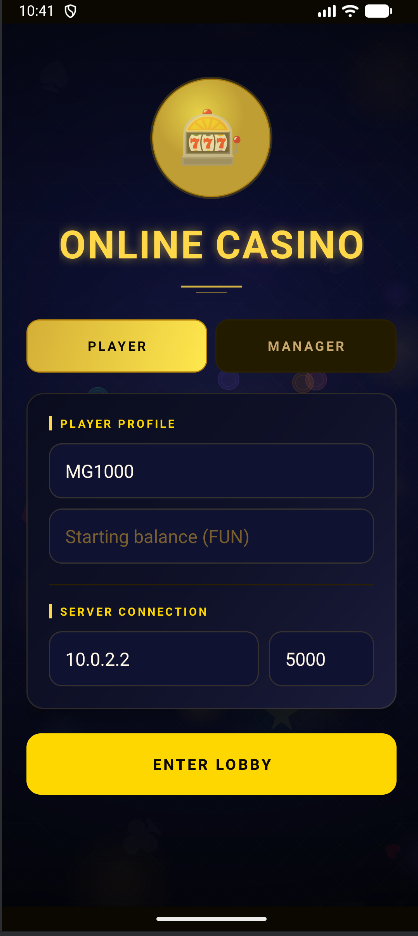
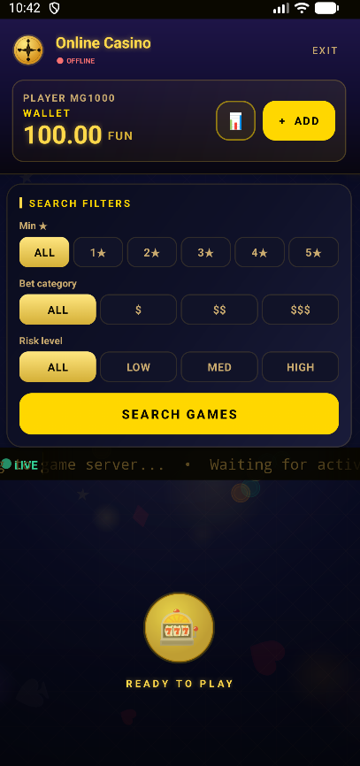
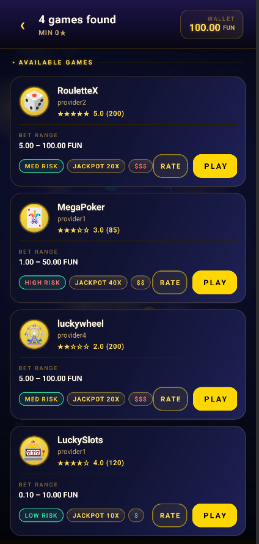
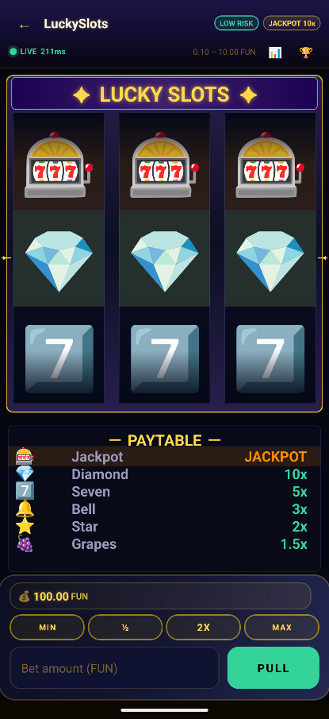
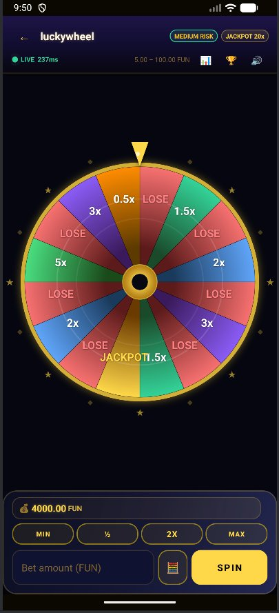
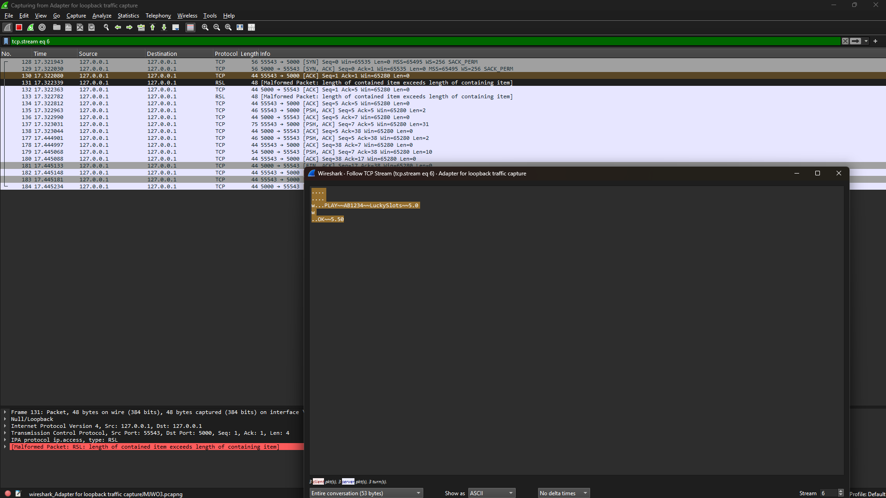
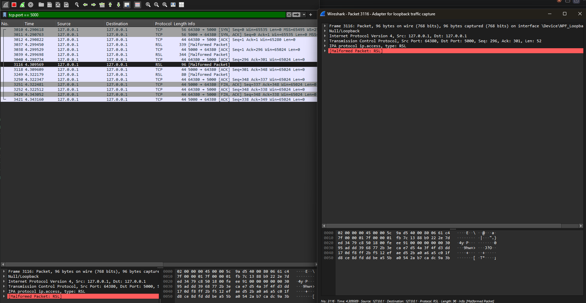

# Online Casino  Distributed Systems

<p align="center">
  
  &nbsp;
</p>

A fully distributed online casino platform built in Java, with a real Android mobile frontend. Players search for games, place bets, and receive live jackpot notifications  all over raw TCP sockets, no frameworks, no database.


## What is it?

Picture a casino where the "house" runs across multiple servers at the same time. A player opens the Android app, picks a game  slot machine, roulette, lucky wheel  bets some FUN currency, and within milliseconds a result comes back. Behind the scenes, a chain of distributed components handles the request: a Master server routes it to the right Worker, the Worker asks a dedicated Random Number Generator for a cryptographically secure random number, computes the payout, and sends it back. If a jackpot hits, every connected player receives a live push notification instantly.

There is no database. No external frameworks. No third-party libraries. Everything — storage, concurrency, communication, fault tolerance — is built entirely on raw Java sockets and the standard JDK.


## Playing the game

When you open the app you land on the login screen. You type a player ID, an initial balance in FUN currency, and the IP address and port of the backend server. For the Android emulator the server is always reachable at `10.0.2.2:5000`; on a real device you use the local network IP of the machine running the backend.

<p align="center">
  
  &nbsp;&nbsp;
  
</p>

Once inside the lobby you see your wallet and a set of search filters: minimum star rating, bet category ($, $$, $$$), and risk level (Low, Medium, High). You hit **Search Games** and the backend responds in real time with a list of matching games, each showing its provider, rating, bet range, jackpot multiplier, and risk tag.

<p align="center">
  
  &nbsp;&nbsp;
  
</p>

Tapping a game takes you to its dedicated screen. LuckySlots shows spinning reels and a full paytable — Diamond 10x, Seven 5x, Bell 3x, Star 2x, Grapes 1.5x — so you know exactly what each outcome is worth before you pull. luckywheel renders a coloured spinning wheel, with each segment mapped to a multiplier or LOSE. Both games show a live millisecond latency indicator and a scrolling ticker at the bottom that streams bets from every active player.

---

## Running the backend

This is a **distributed system** — each component (SRG, Reducer, Worker, Master) is an independent process that communicates with the others over TCP sockets. This means you can run every component on the **same machine** using `localhost`, or spread them across **multiple machines** on the same network by replacing `localhost` with the actual IP address of each machine. The system works either way without any code changes.

### Option A — One machine (Windows)

Double-click `start_all.bat`. It compiles everything and opens each component in its own terminal window automatically.

### Option B — One machine (Linux / Mac)

```bash
find src -name "*.java" > sources.txt && javac -d bin @sources.txt

java -cp bin srg.SecureRandomGenerator 6000        # start first
java -cp bin reducer.Reducer 7000
java -cp bin worker.WorkerNode 0 5001 localhost 6000 localhost 7000
java -cp bin worker.WorkerNode 1 5002 localhost 6000 localhost 7000
java -cp bin master.Master 5000 5003 localhost 7000 localhost:5001 localhost:5002
```

### Option C — Multiple machines

Run each component on a different machine. Replace `localhost` with the actual IP of the machine running that component:

```bash
# Machine A (e.g. 192.168.1.10) — runs SRG and Reducer
java -cp bin srg.SecureRandomGenerator 6000
java -cp bin reducer.Reducer 7000

# Machine B (e.g. 192.168.1.11) — runs Workers and Master
java -cp bin worker.WorkerNode 0 5001 192.168.1.10 6000 192.168.1.10 7000
java -cp bin worker.WorkerNode 1 5002 192.168.1.10 6000 192.168.1.10 7000
java -cp bin master.Master 5000 5003 192.168.1.10 7000 192.168.1.11:5001 192.168.1.11:5002

# Machine C — runs the Android app or DummyPlayer, connecting to Machine B
java -cp bin player.DummyPlayer 192.168.1.11 5000 5001 AB1234 100.0
```

Once the backend is running, open the Android app to play as a Player or launch the Manager console — both connect to the same backend.

---

## Assignment requirements  and how we met them

### TCP sockets for all communication

Every single connection in the system is a raw TCP socket. The Master listens on port 5000 for players and managers, Workers listen on their own ports, the SRG on 6000, and the Reducer on 7000. There is no HTTP, no REST, no message queue. Each request opens a connection, sends a command in our custom `~~`-delimited protocol, reads the response, and closes. The only exception is the broadcast channel on port 5001, which stays open permanently so the Master can push jackpot notifications to connected players without polling.

### Multithreading with `synchronized` and `wait/notify`

No `java.util.concurrent` was used anywhere. Every shared data structure the game registry, the bet history, the subscriber list  is protected with plain `synchronized` blocks. Threads coordinate through `wait()` and `notifyAll()`. This is most visible in the SRG, where a producer thread and a consumer thread share a buffer per game and block each other correctly without any locks or semaphores from the concurrency library.

### Producer-Consumer the Secure Random Generator

The SRG is a standalone server process that maintains one queue per active game. A background producer thread runs continuously for each game, filling its buffer with cryptographically secure random integers (`java.security.SecureRandom`) up to a capacity of 50 numbers. When a Worker needs a random number to resolve a bet, it connects to the SRG and consumes one — blocking if the buffer is empty. This decouples slow entropy generation from the fast request path.

Each number comes bundled with a SHA-256 HMAC computed as `SHA-256(number + gameSecret)`. The Worker verifies this hash before using the number, so the SRG cannot be spoofed by anyone intercepting the internal channel.

### MapReduce for statistics

When a Manager requests statistics — total earnings by game provider, or total profit/loss by player — the Master sends a Map task to every Worker in parallel. Each Worker scans its in-memory bet history and emits partial results over TCP to the Reducer. The Reducer merges them into a final aggregated answer, which the Master then returns to the Manager. The entire pipeline is hand-built: no Hadoop, no Spark, no shared memory between nodes.

### Active Replication and fault tolerance

Every game stored on Worker 1 is simultaneously replicated to Worker 2, and vice versa. When a bet is resolved on the primary Worker, it immediately sends a sync message to the replica so both stay consistent. The Master pings Workers periodically; if one goes silent, all traffic is transparently redirected to the surviving replica and players experience no downtime. Games are distributed across Workers using `hash(gameName) mod N`, so adding more Workers automatically rebalances the load.

### In-memory storage  no database, no external libraries

All game data, bet history, player ratings, and running stats live in standard Java collections inside the Worker and Reducer JVMs. Nothing is persisted to disk during normal operation. The only dependency is the standard JDK — no external library was used anywhere in the project.


# **Extras**
## Security  Encrypted TCP with Diffie-Hellman + AES

### The problem

In the original architecture every message traveled as readable plain text. Anyone on the same network running Wireshark could see everything in real time:

```
PLAY~~player1~~LuckySlots~~10.0
OK~~25.0
ADD_BALANCE~~player1~~500.0
OK~~added
```

With 50–100 observations per game an attacker could reconstruct the full multiplier table of every game and effectively learn the casino's business model without being a Manager. They could replay a winning packet to collect the same prize multiple times, or impersonate a Manager to add and remove games at will.

<p align="center">
  
  <br/><em>Before encryption: protocol strings are fully readable in Wireshark</em>
</p>

### The solution

We implemented a `SecureChannel` class that wraps every **external** TCP connection (Player → Master and Manager → Master) with end-to-end encryption, using only `javax.crypto`, `java.security`, and `java.math.BigInteger` all part of the standard JDK, within the assignment constraints. Internal channels (Master ↔ Worker, Master ↔ Reducer, Master ↔ SRG) were intentionally left as plain `ObjectOutputStream` TCP since they run on a trusted local network.

The handshake works like this. When a connection opens, both sides independently generate a random ephemeral key pair using Diffie-Hellman over RFC 2409 Group 2 (1024-bit MODP). They exchange only their **public** keys over the wire. Each side then computes the shared secret independently  mathematically, `(g^a)^b = (g^b)^a = g^(ab)`  so the secret itself is never transmitted. A 128-bit AES key is derived by taking the first 16 bytes of `SHA-256(shared_secret)`.

```
Player                           Master
  │                                │
  │── DH public key (g^a) ────────►│   safe to intercept
  │◄─ DH public key (g^b) ─────────│   safe to intercept
  │                                │
  │  Both compute g^(ab)           │
  │  without ever sending it       │
  │                                │
  │═══ AES-128-CBC from here ══════│
  │── "PLAY~~p1~~LuckySlots~~10" ─►│   unreadable ciphertext
  │◄─ "OK~~25.0" ──────────────────│   unreadable ciphertext
```

Every message is encrypted with AES-128-CBC and a freshly generated random IV. Even if the exact same command is sent twice, the ciphertext looks completely different — which also makes replay attacks impossible, because replaying the ciphertext produces garbage after decryption on the other side.

<p align="center">
  
  <br/><em>After encryption: Wireshark cannot parse the data — it shows "Malformed Packet: RSL"</em>
</p>

The `SecureChannel` class exposes the same `writeUTF` / `readUTF` API as the original `ObjectOutputStream`, so the rest of the codebase required zero protocol changes. It is a transparent encryption layer sitting between the TCP socket and the application logic.

