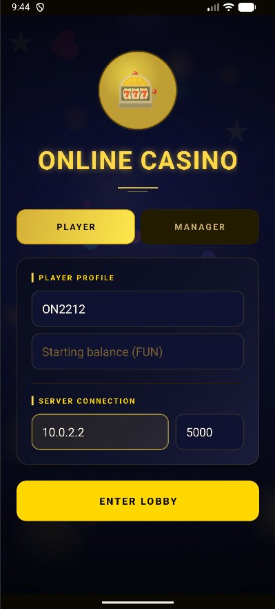
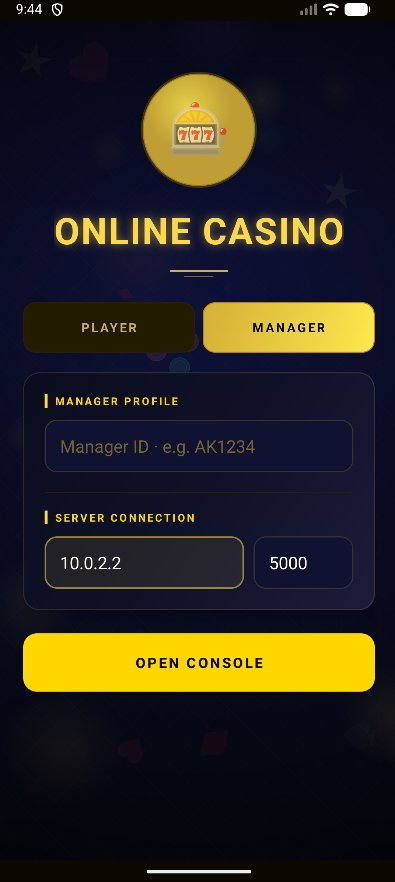
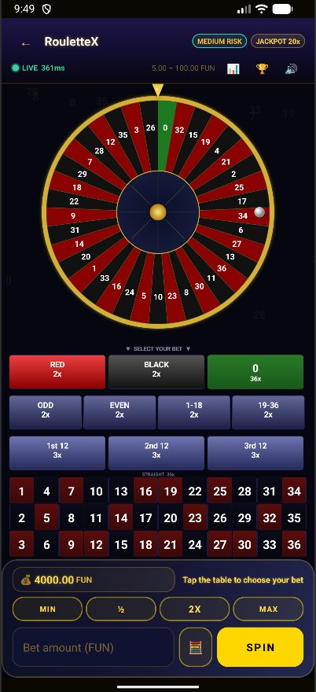
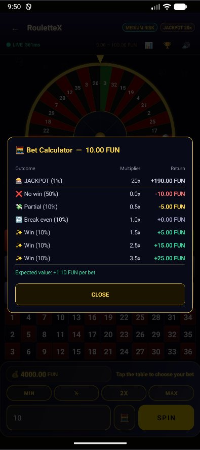
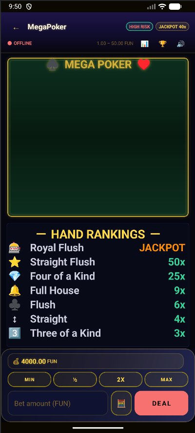
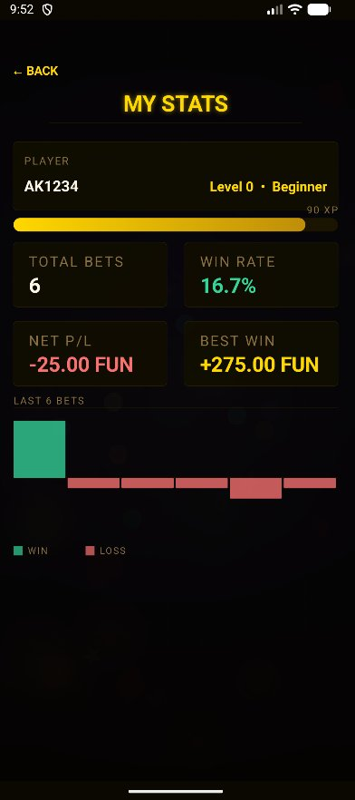
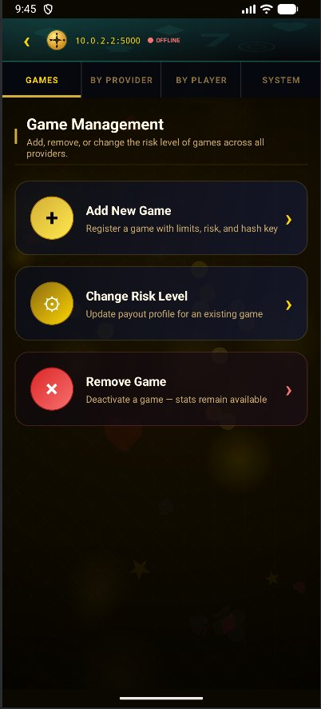
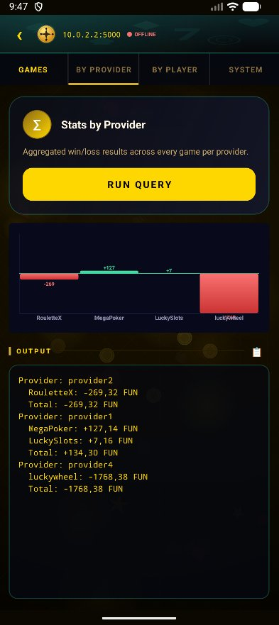
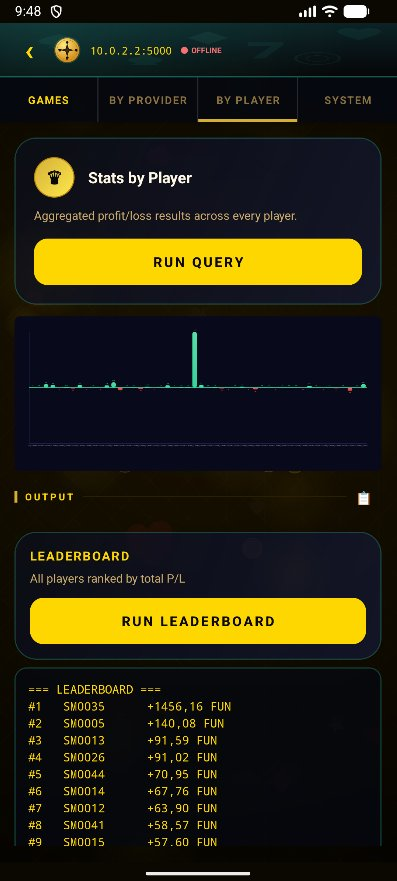
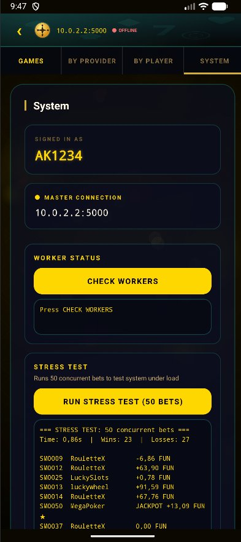

# Online Casino — Distributed Systems

<p align="center">
  
  &nbsp;&nbsp;&nbsp;
  
</p>

A fully distributed online casino platform built in Java, with a real Android mobile frontend. Players search for games, place bets, and receive live jackpot notifications — all over raw TCP sockets, no frameworks, no database.

---

## What is it?

Picture a casino where the "house" runs across multiple servers at the same time. A player opens the Android app, picks a game — slot machine, roulette, lucky wheel, poker — bets some FUN currency, and within milliseconds a result comes back. Behind the scenes, a chain of distributed components handles the request: a Master server routes it to the right Worker, the Worker asks a dedicated Secure Random Generator for a cryptographically verified random number, computes the payout, and sends it back. If a jackpot hits, every connected player gets a live push notification instantly.

There is no database. No external frameworks. No third-party libraries. Everything — storage, concurrency, communication, fault tolerance — is built entirely on raw Java sockets and the standard JDK.

---

## Architecture

```
Android App / DummyPlayer
        │  TCP :5000
        ▼
     MASTER  ──── Broadcast Server :5010 ──► all connected players (jackpot / live ticker)
    /   |   \
   /    |    \         TCP
Worker0 Worker1 ... WorkerN
   \    |    /
    \   |   /         TCP
     REDUCER :7000
        │
   (MapReduce results back to Master)

Each Worker ──TCP──► SRG :6000   (random number per game, producer-consumer)
```

**Port defaults:**

| Component | Port |
|-----------|------|
| Master (players / manager) | 5000 |
| Master broadcast (live ticker) | 5010 |
| Worker 1 | 5001 |
| Worker 2 | 5002 |
| Reducer | 7000 |
| Secure Random Generator | 6000 |

---

## Login Screen

<p align="center">
  
  &nbsp;&nbsp;&nbsp;
  
</p>

The app opens to a single login screen with two roles:

- **Player mode** — enter a Player ID (format: 2 uppercase letters + 4 digits, e.g. `ON2212`), a starting balance in FUN tokens, and the server IP and port. For the Android emulator the backend is reachable at `10.0.2.2:5000`; on a real device use the LAN IP of the machine running the backend.
- **Manager mode** — enter a Manager ID (same format, e.g. `AK1234`) and the server address, then tap **Open Console** to access the full management dashboard.

---

## Player — Lobby

<p align="center">
  
</p>

The lobby is the main hub for players. It shows:

- **Wallet** — current balance in FUN tokens, with a **+ ADD** button to top up.
- **Daily Bonus** — a banner appears when a daily bonus of +100 FUN is claimable.
- **Search Filters** — three independent filters to narrow down games:
  - **Min Stars** — minimum rating (ALL, 1★ through 5★)
  - **Bet Category** — spending tier ($, $$, $$$, or ALL)
  - **Risk Level** — LOW, MED, HIGH, or ALL
- **Live Ticker** — a scrolling bar at the bottom streams real-time bets from all active players on the server.
- **SEARCH GAMES** button — sends the selected filters asynchronously to the Master and populates the results screen.

---

## Player — Game List

<p align="center">
  
</p>

Search results appear as a scrollable card list. Each card shows:

- Game name and provider
- Star rating and number of votes
- Bet range in FUN
- Risk level badge (LOW / MED / HIGH RISK)
- Jackpot multiplier (e.g. JACKPOT 20X)
- Bet category chip ($, $$, $$$)
- **RATE** button — opens a 1–5 star rating dialog
- **PLAY** button — navigates into the game screen

---

## Player — Games

### RouletteX

<p align="center">
  
</p>

A full European roulette wheel with a complete betting table. Players can:

- Choose a bet type by tapping: **RED / BLACK** (2x), **ODD / EVEN** (2x), **1–18 / 19–36** (2x), column bets (1st/2nd/3rd 12, 3x), or any straight number (36x)
- Use the **MIN / ½ / 2X / MAX** quick-fill buttons for the bet amount
- Open the **Bet Calculator** (abacus icon) to preview all possible outcomes before committing
- Hit **SPIN** to send the play request to the backend

A live latency indicator (e.g. `LIVE 361ms`) shows the round-trip time to the Master server in real time.

### Bet Calculator

<p align="center">
  
</p>

Tapping the calculator icon opens a modal that breaks down every possible outcome for the current bet amount — probability, multiplier, and exact return — plus the **Expected value per bet**. Computed locally from the game's risk table and jackpot value.

### LuckyWheel

<p align="center">
  
</p>

An animated spinning wheel divided into coloured segments, each mapped to a multiplier or LOSE. The wheel is rendered as a custom `Canvas` view that animates a deceleration spin on result. Players set a bet amount and tap **SPIN**; the server returns the outcome index which determines which segment the pointer lands on.

### MegaPoker

<p align="center">
  
</p>

A video poker game with a full hand-ranking paytable visible before betting: Royal Flush (JACKPOT), Straight Flush (50x), Four of a Kind (25x), Full House (9x), Flush (6x), Straight (4x), Three of a Kind (3x). Players tap **DEAL** to play; the result from the server determines the hand.

### LuckySlots

<p align="center">
  
</p>

A classic 3-reel slot machine with animated spinning reels. The paytable is always visible below the reels: Jackpot, Diamond (10x), Seven (5x), Bell (3x), Star (2x), Grapes (1.5x). Tapping **PULL** sends the play request; the three reel outcomes are determined by the server's random number.

---

## Player — My Stats

<p align="center">
  
</p>

The stats screen (accessible via the trophy icon in any game) shows the player's full session history:

- **Level & XP** — a progression bar (e.g. Level 0 · Beginner, 90 XP)
- **Total Bets** — number of rounds played
- **Win Rate** — percentage of rounds won
- **Net P/L** — total profit or loss in FUN
- **Best Win** — largest single win in FUN
- **Last N Bets chart** — a bar chart where green bars are wins and pink bars are losses

---

## Manager Dashboard

The Manager interface has four tabs: **GAMES**, **BY PROVIDER**, **BY PLAYER**, and **SYSTEM**.

### Games Tab

<p align="center">
  
</p>

Three actions available:

- **Add New Game** — register a new game by providing a JSON file with name, provider, bet limits, risk level, and hash key. The Master hashes the game name to select the target Worker (`H(GameName) mod N`), stores it in memory, and replicates it to all other Workers.
- **Change Risk Level** — update the payout profile of an existing game (LOW / MEDIUM / HIGH each has a different multiplier table and jackpot value).
- **Remove Game** — deactivate a game so it no longer appears in player searches. Historical stats (wins/losses) are preserved and still appear in analytics queries.

### Stats by Provider

<p align="center">
  
</p>

Tap **RUN QUERY** to trigger a full **MapReduce** across all Workers. Each Worker emits intermediate results (provider → game → house balance) to the Reducer; the Reducer aggregates and returns the final totals to the Master. Results show:

- Per-game house profit/loss in FUN for each provider
- Provider total
- A bar chart comparing net results across all games

### Stats by Player + Leaderboard

<p align="center">
  
</p>

**Stats by Player** runs a second MapReduce to compute total P/L per player across all Workers. **RUN LEADERBOARD** produces a ranked list sorted by total profit descending.

### System Tab

<p align="center">
  
</p>

- **Signed-in Manager ID** and **Master connection address**
- **Check Workers** — pings all Worker nodes and returns their status (ONLINE/OFFLINE), number of active games, and total bets processed
- **Stress Test** — fires N concurrent bets across all active games simultaneously. Verifies that concurrent synchronisation works correctly under load.

---

## Running the backend

Each component is an independent process communicating over TCP sockets. You can run everything on **one machine** using `localhost`, or spread across **multiple machines** on the same network.

### Step 1 — Compile

**Linux / Mac:**
```bash
find src -name "*.java" > sources.txt
javac -d bin @sources.txt
```

**Windows:**
```bat
compile.bat
```

### Step 2 — Start components in order

**Linux / Mac (one machine):**
```bash
# 1. Secure Random Generator
java -cp bin srg.SecureRandomGenerator 6000

# 2. Reducer
java -cp bin reducer.Reducer 7000

# 3. Worker 1
java -cp bin worker.WorkerNode 0 5001 localhost 6000 localhost 7000

# 4. Worker 2
java -cp bin worker.WorkerNode 1 5002 localhost 6000 localhost 7000

# 5. Master  (port=5000, broadcast=5003, 2 workers)
java -cp bin master.Master 5000 5010 localhost 7000 localhost:5001 localhost:5002

# 6. Manager console
java -cp bin manager.ManagerApp localhost 5000 AK1234

# 7. DummyPlayer (for testing — real frontend is the Android app)
java -cp bin player.DummyPlayer localhost 5000 5010 AB1234 500.0
```

**Windows:** double-click `start_all.bat` to compile and open every component in its own terminal window.

### Multiple machines example

```bash
# Machine A (192.168.1.10) — SRG and Reducer
java -cp bin srg.SecureRandomGenerator 6000
java -cp bin reducer.Reducer 7000

# Machine B (192.168.1.11) — Workers and Master
java -cp bin worker.WorkerNode 0 5001 192.168.1.10 6000 192.168.1.10 7000
java -cp bin worker.WorkerNode 1 5002 192.168.1.10 6000 192.168.1.10 7000
java -cp bin master.Master 5000 5010 192.168.1.10 7000 192.168.1.11:5001 192.168.1.11:5002

# Machine C — Manager or DummyPlayer connecting to Machine B
java -cp bin manager.ManagerApp 192.168.1.11 5000 AK1234
java -cp bin player.DummyPlayer 192.168.1.11 5000 5010 AB1234 500.0
```

### Android app

Open the `android/` folder in Android Studio, sync Gradle, and run on an emulator or device.
- **Emulator:** connect to `10.0.2.2:5000` (broadcast `10.0.2.2:5010`)
- **Real device (same LAN):** use the machine's LAN IP

---

## Component reference

### Master
```
java -cp bin master.Master <masterPort> <broadcastPort> <reducerHost> <reducerPort> <host:port> [<host:port> ...]
```
Example: `java -cp bin master.Master 5000 5010 localhost 7000 localhost:5001 localhost:5002`

### WorkerNode
```
java -cp bin worker.WorkerNode <id> <port> <srgHost> <srgPort> <reducerHost> <reducerPort>
```
Example: `java -cp bin worker.WorkerNode 0 5001 localhost 6000 localhost 7000`

### Reducer
```
java -cp bin reducer.Reducer [port]
```
Default port: 7000

### SecureRandomGenerator
```
java -cp bin srg.SecureRandomGenerator [port]
```
Default port: 6000

### ManagerApp
```
java -cp bin manager.ManagerApp <masterHost> <masterPort> <managerId>
```
Manager ID format: 2 uppercase letters + 4 digits (e.g. `AK1234`)

**Manager menu options:**
1. Add game (from JSON file)
2. Remove game
3. Update game risk level
4. Show stats by Provider (MapReduce)
5. Show stats by Player (MapReduce)
6. Leaderboard — all players ranked by P/L (MapReduce)
7. Worker Health Status
8. Run Stress Test

### DummyPlayer
```
java -cp bin player.DummyPlayer <masterHost> <masterPort> <broadcastPort> <playerId> <initialBalance>
```
Player ID format: 2 uppercase letters + 4 digits (e.g. `AB1234`)

**Player menu options:**
1. Search games (filter by stars, bet category, risk)
2. Add balance (FUN tokens)
3. Rate a game (1–5 stars)
4. Exit

---

## Adding a game (JSON format)

Place the JSON file in `sample_data/` (or anywhere accessible). Pass the path to the Manager.

```json
{
  "GameName": "LuckySlots",
  "ProviderName": "provider1",
  "Stars": 4,
  "NoOfVotes": 120,
  "GameLogo": "/usr/bin/images/luckyslots.png",
  "MinBet": 0.1,
  "MaxBet": 10,
  "RiskLevel": "low",
  "HashKey": "secret_lucky_001"
}
```

`BetCategory` and `Jackpot` are **computed automatically** by the system:

| MinBet | BetCategory |
|--------|-------------|
| ≤ 0.1 FUN | $ |
| ≤ 1.0 FUN | $$ |
| > 1.0 FUN | $$$ |

| RiskLevel | Jackpot multiplier | Multiplier table |
|-----------|-------------------|-----------------|
| low | 10x | [0, 0, 0, 0.1, 0.5, 1.0, 1.1, 1.3, 2.0, 2.5] |
| medium | 20x | [0, 0, 0, 0, 0, 0.5, 1.0, 1.5, 2.5, 3.5] |
| high | 40x | [0, 0, 0, 0, 0, 0, 0, 1.0, 2.0, 6.5] |

---

## How it works

### TCP sockets for all communication

Every connection is a raw TCP socket. The Master listens on port 5000 for players and managers, Workers on their own ports, SRG on 6000, Reducer on 7000. There is no HTTP, no REST, no message queue. Each request opens a connection, sends a command in our custom `~~`-delimited protocol, reads the response, and closes.

The broadcast channel on port 5010 stays **permanently open** so the Master can push jackpot and bet notifications to connected players without polling.

### Multithreading with `synchronized` and `wait/notify`

No `java.util.concurrent` was used anywhere. Every shared data structure — the game registry, the bet history, the subscriber list — is protected with plain `synchronized` blocks. Threads coordinate through `wait()` and `notifyAll()`. This is most visible in the SRG, where a producer thread and a consumer thread share a buffer per game.

### Producer-Consumer — Secure Random Generator

The SRG is a standalone server process that maintains one queue per active game. A background producer thread runs continuously for each game, filling its buffer with cryptographically secure random integers (`java.security.SecureRandom`) up to a capacity of 50 numbers. When a Worker needs a random number to resolve a bet, it connects to the SRG and consumes one — blocking if the buffer is empty. Each number comes bundled with a SHA-256 HMAC (`SHA-256(number + gameSecret)`) that the Worker verifies before use.

### Payout calculation

When a bet arrives at the Worker:
1. Get a random integer from SRG, verify SHA-256 hash.
2. `rand % 100 == 0` → **Jackpot**: payout = `bet × jackpotMultiplier`
3. Otherwise: `index = rand % 10` → payout = `bet × riskTable[index]`
4. Record the bet in the in-memory `BetRecord` list; update house balance under `synchronized`.

### MapReduce for statistics

When a Manager requests statistics, the Master sends a Map task to every Worker **in parallel**. Each Worker scans its in-memory bet history and emits partial results over TCP to the Reducer. The Reducer merges them using `wait/notify` synchronisation until all Workers have reported, then returns the final aggregated answer to the Master. No Hadoop, no Spark, no shared memory.

### Active Replication (Bonus)

Every game stored on Worker 0 is simultaneously replicated to Worker 1, and vice versa. When a bet is resolved on the primary Worker, it immediately sends a sync message to all replicas. If a Worker goes silent, all traffic is transparently redirected to the surviving replica. If the primary recovers, the Master re-hydrates it from the replica automatically. Games are distributed using `|hash(gameName)| mod N`.

### In-memory storage

All game data, bet history, player ratings, and running stats live in standard Java collections inside the Worker and Reducer JVMs. Nothing is persisted to disk (except game logo files if provided). The only dependency is the standard JDK.

---

## Team

| AM | Name |
|----|------|
| 3230096 | Χρήστος Λαβίδας |
| 3230188 | Νίκος Κέλλερ |
| 3230064 | Ανδρέας Ζεν |

OPA — Department of Informatics — Distributed Systems — Spring 2025-2026
